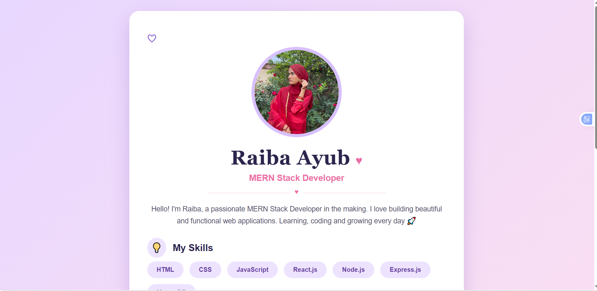

# CSS Task 1 - Profile Card

This is my first CSS practice task.  
I created a personal profile card using HTML and CSS.

## Output Screenshot

## Features

- Profile image
- Introduction paragraph
- Skills list
- GitHub profile button
- Contact button
- Contact form
- Hover effects
- Responsive design

## Technologies Used

- HTML
- CSS

## What I Learned

- How to center a card using CSS
- How to style images with border-radius
- How to use gradients and shadows
- How to create hover effects
- How to design a simple contact form

## Author

Raiba Ayub
